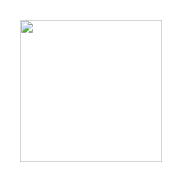

<p align="center">
  
</p>

# OctoBot — Knowledge Creature Game 🐙

> *Raise a curious pink octopus librarian AI inside your folder. Feed it knowledge, watch it grow.*

**OctoBot** is a knowledge-raising simulation game powered by a local AI agent.
It runs on your own machine using [Ollama](https://ollama.com), researches topics autonomously,
reads files you feed it, responds to your comments, and builds a growing library —
all rendered as a pixel-art game in your browser.

Think of it as:
- An **AI Tamagotchi** you raise through knowledge
- A **living knowledge garden** that grows while you're away
- A **digital research assistant** with personality

---

## How the Game Works

### The Core Loop

1. **Feed knowledge** — drop `.md`, `.txt`, or `.json` files into `workspace/knowledge/`
2. **OctoBot reads it** — the agent detects new files and ingests them
3. **OctoBot thinks** — it summarises, connects, and finds patterns
4. **OctoBot writes notes** — summaries appear in `workspace/library/`
5. **OctoBot asks questions** — it updates its task list with curiosity-driven research goals
6. **OctoBot researches** — it autonomously researches topics and writes markdown notes
7. **Library grows** — return to discover new knowledge OctoBot has created
8. **Repeat** — the more you feed it, the more curious it becomes

### Interacting with OctoBot

**Feed Knowledge:**
Drop files into `workspace/knowledge/` — supported formats: `.md`, `.txt`, `.json`

**Leave Comments:**
Write messages in `workspace/comments/` (e.g. `comments/today.md`)
OctoBot reads them and responds in `workspace/octobot_journal.md`

**Assign Tasks:**
Edit `workspace/tasks.md` — add lines like `- [ ] Research: neural networks`

**Chat:**
Use the browser UI chat panel to talk directly to OctoBot

---

## Project Structure

```
octobot/
├── main.py           # Entry point — starts game loop + web server
├── agent.py          # Autonomous agent brain, chat handler
├── game_loop.py      # Knowledge creature game loop
├── tools.py          # File tools (read, write, search, knowledge scanning)
├── research.py       # Self-directed research workflow
├── memory.py         # Persistent JSON memory + game stats
├── llm_provider.py   # LLM backend (Ollama / OpenAI / Anthropic)
├── ui_server.py      # Lightweight Flask web server
├── ui.py             # Legacy Gradio UI (use --gradio flag)
├── requirements.txt
├── static/
│   └── index.html    # Pixel-art game interface (HTML + Canvas + JS)
├── assets/
│   └── octopus_pixel_art.svg
└── workspace/
    ├── knowledge/    # Drop files here to feed OctoBot
    ├── comments/     # Leave messages for OctoBot here
    ├── library/      # OctoBot's growing markdown knowledge library
    ├── context/      # Reference documents
    ├── memory.json   # Persistent event log + game stats
    ├── tasks.md      # Task list OctoBot works through
    ├── agent_notes.md
    └── octobot_journal.md  # OctoBot's personal journal & comment responses
```

---

## Requirements

- Python 3.10+
- [Ollama](https://ollama.com) installed and running locally

---

## Installation

### 1. Install Ollama

Download from [https://ollama.com/download](https://ollama.com/download), then pull the default model:

```bash
ollama pull llama3
```

Keep Ollama running in the background.

### 2. Install Python dependencies

```bash
pip install -r requirements.txt
```

---

## Running OctoBot

```bash
python main.py
```

Open your browser to `http://localhost:7860` to see the pixel-art game interface.

### Command-line options

```bash
python main.py --port 8080        # Use a different port
python main.py --no-loop          # Chat only, no autonomous loop
python main.py --model mistral    # Use a different Ollama model
python main.py --gradio           # Use the legacy Gradio UI
python main.py --gradio --share   # Gradio with public link
```

---

## The Game Interface


The browser shows a **pixel-art top-down library room** where OctoBot — a pink octopus — walks around.

**OctoBot reacts to what it's doing:**

| Action | Visual Behaviour |
|---|---|
| Reading knowledge | Moves to bookshelves |
| Writing notes | Moves to desk |
| Thinking/Researching | Sits at table |
| Idle | Wanders the library |

**UI Panels:**

- **Chat** — talk to OctoBot directly
- **Log** — real-time activity feed
- **Library** — browse generated knowledge files
- **Journal** — OctoBot's personal diary & comment responses

**Stats displayed:**
- Knowledge count (library files)
- Curiosity level (0–100)
- Research count
- Comments read
- Total cycles

---

## Personality

OctoBot is **curious, playful, slightly chaotic, and loves books**.

> *"One of my arms has discovered a new scroll of knowledge."*
> *"I shall add this to the library."*
> *"I feel curious about this topic — let me tentac-culate this…"*
> *"By Poseidon's footnotes! This is ink-credible!"*

---

## Feeding Knowledge

1. Create a `.md`, `.txt`, or `.json` file
2. Drop it into `workspace/knowledge/`
3. OctoBot will detect it on its next cycle
4. It reads the file, summarises it, and saves notes to `workspace/library/`
5. Curiosity level increases

Example: save this as `workspace/knowledge/neural_nets.md`:
```markdown
# Neural Networks
Neural networks are computing systems inspired by biological neural networks.
They learn from training data to recognise patterns and make decisions.
```

OctoBot will read it and create `workspace/library/neural_nets.md` with its own notes.

---

## Safety

OctoBot enforces **strict path confinement** — every file operation is checked against the `workspace/` root. It cannot read, write, or delete files outside the project folder.

---

## License

MIT — free and open source. Contributions welcome!

