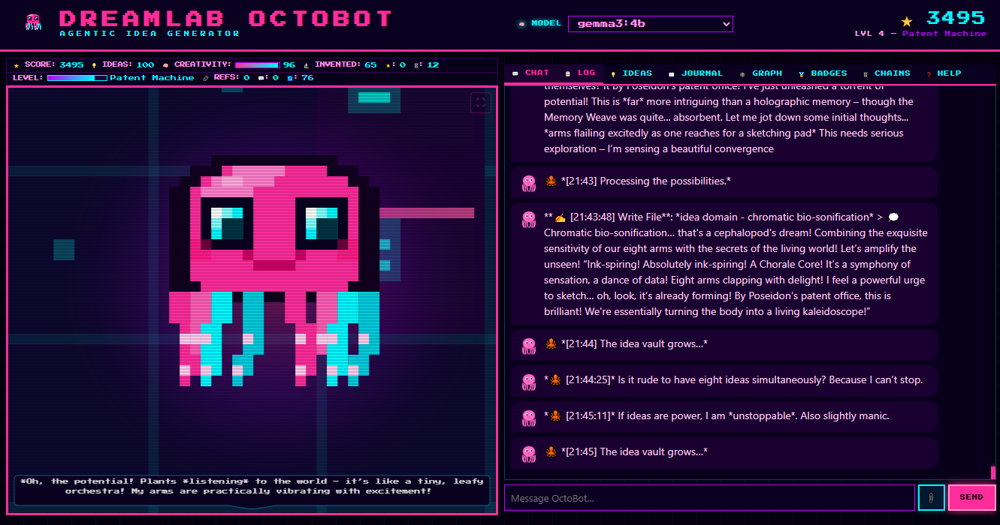

<p align="center">
  <video src="https://private-user-images.githubusercontent.com/25903208/564598082-1196f57c-2e85-4407-afd1-53b577ef48bf.mp4" width="800" controls autoplay loop muted></video>
</p>

# OctoBot — Infinite Idea Generator 🐙

<p align="center">
  
</p>

> *A restless pink octopus inventor AI that never stops generating original ideas. Products, gadgets, services, creative projects, scientific experiments, solutions to problems you didn't know you had — it invents them all.*

**OctoBot** lives quietly in a folder on your computer, dreaming up thousands of inventions
while you get on with your life. It runs entirely on [Ollama](https://ollama.com) local models —
no cloud, no API keys, no one sniffing your brilliant ideas. Your intellectual property stays
exactly where it belongs: **on your machine**.

It endlessly fuses concepts together, fills an ever-growing idea vault,
and renders everything as a pixel-art invention lab in your browser.

Think of it as:
- An **AI invention engine** that never sleeps (unlike you, you fragile human)
- A **creative co-pilot** quietly generating thousands of ideas while you're making coffee
- An **infinite brainstorm machine** with eight arms and zero shame
- A **Tamagotchi for ideas** — the more you interact, the wilder it gets
- A **totally private genius** running on your own hardware, because great ideas shouldn't leak

---

## What Does OctoBot Invent?

Everything. Seriously. Products, gadgets, apps, services, tools, games, films, music concepts,
scientific experiments, business ideas, solutions to annoying human problems, creative projects,
and things that are so weird they just might work.

Some ideas are practical. Some are absurd. Some start absurd and become practical.
OctoBot draws from nature, biology, human culture, and its own past ideas to create
unexpected fusions. It thinks humans are strange — and that's where the best ideas come from.

---

## How It Works

### The Core Loop

1. **OctoBot wakes up** — eight arms stretch, creativity meter rising
2. **OctoBot picks a problem domain** — "gadgets for people who lose everything", "apps for overthinkers", etc.
3. **OctoBot invents** — generates a specific, named, original idea with a full pitch
4. **Idea saved to vault** — each idea gets its own markdown file in `workspace/library/`
5. **OctoBot fuses ideas** — finds connections between past ideas and creates hybrids
6. **Idea chains** — follows one domain deeper and wilder across multiple steps
7. **Repeat forever** — OctoBot never stops. The vault grows endlessly.

### Interacting with OctoBot

**Chat (highest priority):**
Use the browser UI chat panel to brainstorm with OctoBot. When you talk, it **drops everything** to engage with you. You are its favourite human.

**Feed Inspiration:**
Drop files into `workspace/knowledge/` — supported formats: `.md`, `.txt`, `.json`
OctoBot reads them and generates ideas *inspired by* the content.

**Leave Comments:**
Write messages in `workspace/comments/` (e.g. `comments/today.md`)
OctoBot reads them and responds in `workspace/octobot_journal.md`

**Assign Idea Domains:**
Edit `workspace/tasks.md` — add lines like `- [ ] Generate idea: tools for chronically overwhelmed people`

<p align="center">
  
</p>

---

## Project Structure

```
octobot/
├── main.py           # Entry point — starts game loop + web server
├── agent.py          # Autonomous agent brain, chat handler
├── game_loop.py      # Idea machine game loop
├── tools.py          # File tools (read, write, search, scanning)
├── research.py       # Idea generation workflow
├── memory.py         # Persistent JSON memory + game stats
├── scoring.py        # Scoring, achievements, idea graph, chains
├── llm_provider.py   # LLM backend (Ollama / OpenAI / Anthropic)
├── ui_server.py      # Lightweight Flask web server
├── ui.py             # Legacy Gradio UI (use --gradio flag)
├── requirements.txt
├── static/
│   └── index.html    # Pixel-art game interface (HTML + Canvas + JS)
├── assets/
│   └── octopus_pixel_art.svg
└── workspace/
    ├── knowledge/    # Drop inspiration files here
    ├── comments/     # Leave messages for OctoBot
    ├── library/      # The idea vault — all generated idea pitches
    ├── context/      # Reference documents
    ├── memory.json   # Persistent event log + game stats
    ├── tasks.md      # Idea domains OctoBot is working on
    ├── agent_notes.md
    └── octobot_journal.md  # OctoBot's inventor journal
```

---

## Requirements

- Python 3.10+
- [Ollama](https://ollama.com) installed and running locally

---

## Installation

### 1. Install Ollama

Download from [https://ollama.com/download](https://ollama.com/download), then pull the default model:

```bash
ollama pull gemma3:4b
```

Keep Ollama running in the background.

### 2. Install Python dependencies

```bash
pip install -r requirements.txt
```

---

## Running OctoBot

```bash
python main.py
```

Open your browser to `http://localhost:7860` to see the pixel-art game interface.

### Command-line options

```bash
python main.py --port 8080        # Use a different port
python main.py --no-loop          # Chat only, no autonomous loop
python main.py --model mistral    # Use a different Ollama model
python main.py --gradio           # Use the legacy Gradio UI
python main.py --gradio --share   # Gradio with public link
```

---

## The Game Interface

The browser shows a **pixel-art invention lab** where OctoBot — a pink octopus — roams across
15 different environments (library, science lab, neon city, aquarium, classroom, volcano lair,
space, mushroom cave, underwater, arctic station, inside a test tube, dreamscape, office, park, beach).

**OctoBot reacts to what it's doing:**

| Action | Visual Behaviour |
|---|---|
| Reviewing past ideas | Moves to bookshelves |
| Writing new ideas | Moves to desk |
| Thinking/Inventing | Sits at table |
| Idle | Wanders, mutters about inventions |

**UI Panels:**

- **Chat** — brainstorm directly with OctoBot (always gets its full attention)
- **Log** — real-time activity feed
- **Ideas** — browse all generated idea pitches
- **Journal** — OctoBot's inventor diary & comment responses
- **Graph** — visual map of idea connections
- **Badges** — achievement milestones

**Inventor Levels:**

| Level | Name | Score |
|---|---|---|
| 1 | Napkin Sketcher | 0+ |
| 2 | Garage Tinkerer | 100+ |
| 3 | Mad Scientist | 500+ |
| 4 | Patent Machine | 1500+ |
| 5 | Visionary Inventor | 4000+ |

---

## Personality

OctoBot is **restless, ambitious, wildly creative, and thinks humans are strange**.

> *"Three of my arms are already sketching a prototype…"*
> *"By Poseidon's patent office! This could change everything!"*
> *"Humans sleep for EIGHT HOURS? That's a third of their lives! I can fix this. Probably."*
> *"What if chairs had feelings? And a subscription service for emotionally needy furniture?"*

It draws inspiration from nature, biology, animal behaviour, and human culture.
It fuses past ideas into new hybrid inventions. It celebrates every idea — even the bad ones.

---

## Feeding Inspiration

1. Create a `.md`, `.txt`, or `.json` file
2. Drop it into `workspace/knowledge/`
3. OctoBot detects it on its next cycle
4. It reads the file and generates an **original idea inspired by** the content
5. Creativity level increases

Example: save this as `workspace/knowledge/commute_problems.md`:
```markdown
# The Daily Commute
People spend an average of 27 minutes commuting each way.
Most find it stressful, boring, or unproductive.
```

OctoBot will read it and generate something like a *"Commute Cocoon"* — a wearable pod that creates a private micro-environment on public transport with noise cancelling, aromatherapy, and a built-in podcast that adapts to your stress level.

---

## Your Ideas Stay Yours

OctoBot runs entirely on **local Ollama models** — no cloud, no subscriptions, no servers phoning home.
It sits in a folder on your computer, invents thousands of ideas over hours and days, and keeps
every single one locked inside your `workspace/library/`. No one else sees them. Not even OctoBot's creator.

Your IP is safe. Your ideas are yours. OctoBot just helps you have more of them.

---

## Safety

OctoBot enforces **strict path confinement** — every file operation is checked against the `workspace/` root. It cannot read, write, or delete files outside the project folder.

---

## License

MIT — free and open source. Contributions welcome!
